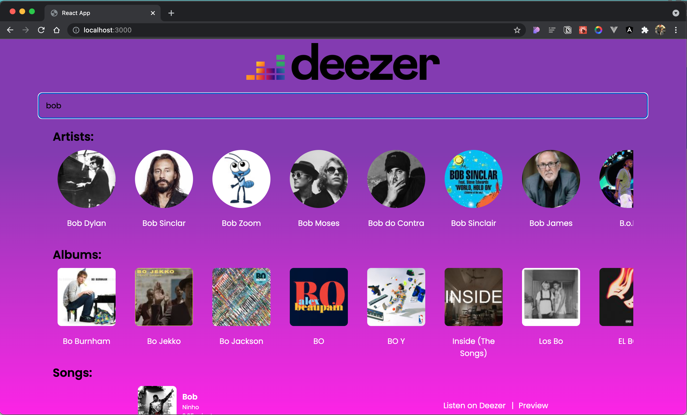

# Deezer Search



## Rodando o aplicativo

```
git clone https://github.com/javi-domi/deezerReact.git

cd deezerReact

docker-compose up

```

O front end roda na porta :3000

http://localhost:3000

## Observações

- Para solucionar erro de CORS foi necessário utilizar Express e Axios
